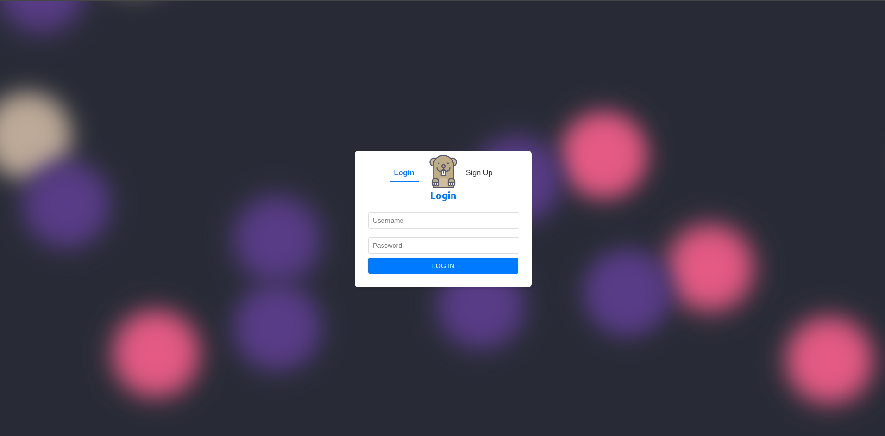
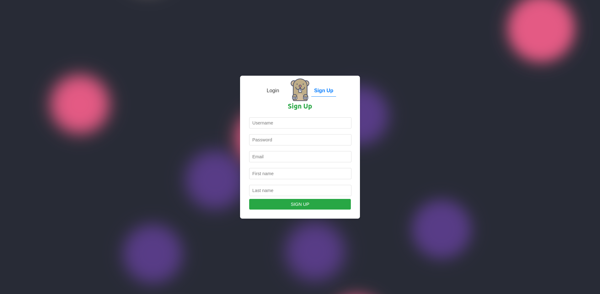
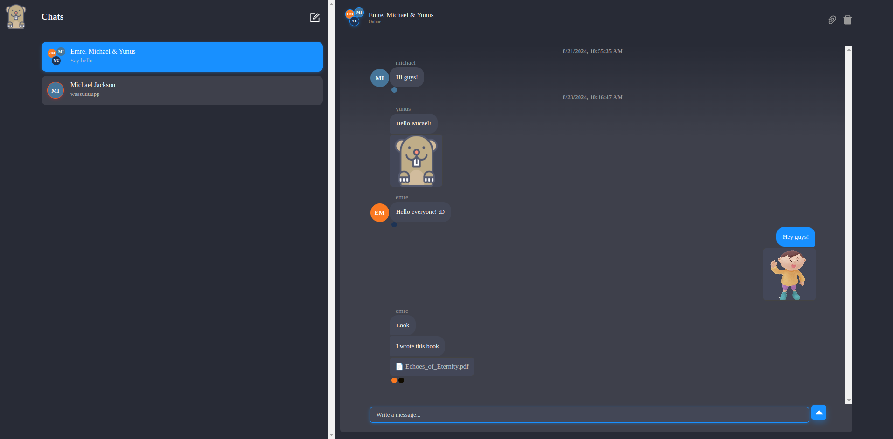
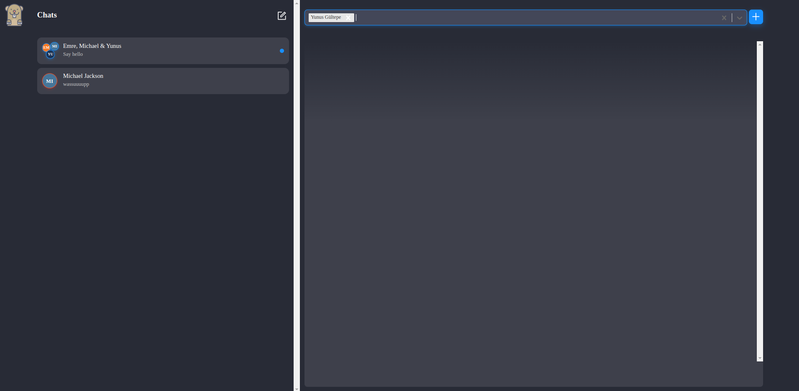
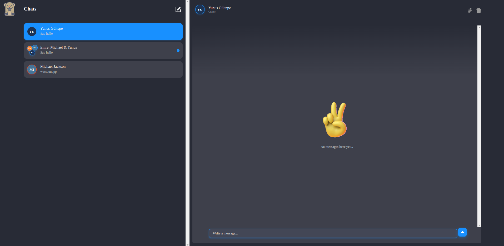

# MoleChat MoleChat MoleChat

[](https://github.com/Mordris/MoleChat)
[](https://github.com/Mordris/MoleChat/commits/main)

<!-- Add other relevant badges if desired, e.g., license, build status -->

A sleek and functional real-time web chat application built with React, Node.js, and powered by Chat Engine. MoleChat provides a simple interface for users to sign up, log in, and engage in instant messaging.

## ✨ Features

- **User Authentication:** Secure Sign Up and Login functionality.
- **Real-time Chat:** Instant messaging powered by Chat Engine.
- **Clean UI:** Utilizes `react-chat-engine-pretty` for an enhanced chat experience.
- **Custom Styling:** Includes a unique animated background on the authentication page and custom styles for components.
- **Loading States:** Provides visual feedback during asynchronous operations (login/signup).

## 📸 Screenshots

**Authentication Page (Login/Sign Up Toggle):**




_Description: Shows the login and signup forms with the toggle buttons and the animated background._

**Chat Interface:**





_Description: Displays the main chat window after a user has logged in, showing chat lists, an active conversation, and potentially settings or options._

## 💻 Technology Stack

- **Frontend:**
  - React
  - `react-chat-engine-pretty`
  - `axios`
  - CSS
- **Backend:**
  - Node.js
  - Express
  - `axios`
  - `cors`
  - `dotenv`
- **Service:**
  - Chat Engine (https://chatengine.io/) - Handles chat backend, user management, and real-time communication.

## 🚀 Getting Started

Follow these instructions to get a copy of the project up and running on your local machine for development and testing purposes.

### Prerequisites

- **Node.js and npm:** Make sure you have Node.js (which includes npm) installed. You can download it from [nodejs.org](https://nodejs.org/).
- **Chat Engine Account:** You need a project set up on [Chat Engine](https://chatengine.io/). You will need the **Project ID** and **Private Key**.

### Installation & Setup

1.  **Clone the repository:**

    ```bash
    git clone https://github.com/Mordris/MoleChat.git
    cd MoleChat
    ```

2.  **Backend Setup:**

    - Navigate to the backend directory:
      ```bash
      cd backend
      ```
    - Install dependencies:
      ```bash
      npm install
      ```
    - Create a `.env` file in the `backend` directory and add your Chat Engine credentials:
      ```dotenv
      # backend/.env
      CHAT_ENGINE_PROJECT_ID=your_chat_engine_project_id
      CHAT_ENGINE_PRIVATE_KEY=your_chat_engine_private_key
      ```
      _(Replace `your_chat_engine_project_id` and `your_chat_engine_private_key` with your actual credentials from Chat Engine.)_

3.  **Frontend Setup:**
    - Navigate to the frontend directory from the root `MoleChat` folder:
      ```bash
      cd ../frontend
      # Or if you are still in backend: cd ../frontend
      ```
    - Install dependencies:
      ```bash
      npm install
      ```
    - Create a `.env` file in the `frontend` directory and add your Chat Engine Project ID:
      ```dotenv
      # frontend/.env
      REACT_APP_CHAT_ENGINE_PROJECT_ID=your_chat_engine_project_id
      ```
      _(Replace `your_chat_engine_project_id` with your actual Project ID. Note the `REACT_APP_` prefix required by Create React App.)\_

### Running the Application

You need to run both the backend and frontend servers concurrently.

1.  **Start the Backend Server:**

    - Open a terminal, navigate to the `backend` directory:
      ```bash
      cd /path/to/MoleChat/backend
      ```
    - Start the server:
      ```bash
      node index.js
      ```
    - The backend server will start on `http://localhost:3001`.

2.  **Start the Frontend Development Server:**
    - Open _another_ terminal, navigate to the `frontend` directory:
      ```bash
      cd /path/to/MoleChat/frontend
      ```
    - Start the React app:
      ```bash
      npm start
      ```
    - The frontend application will open automatically in your default browser at `http://localhost:3000`.

Now you can access MoleChat in your browser, sign up for a new account, or log in with existing credentials!

---

Feel free to contribute or report issues!
